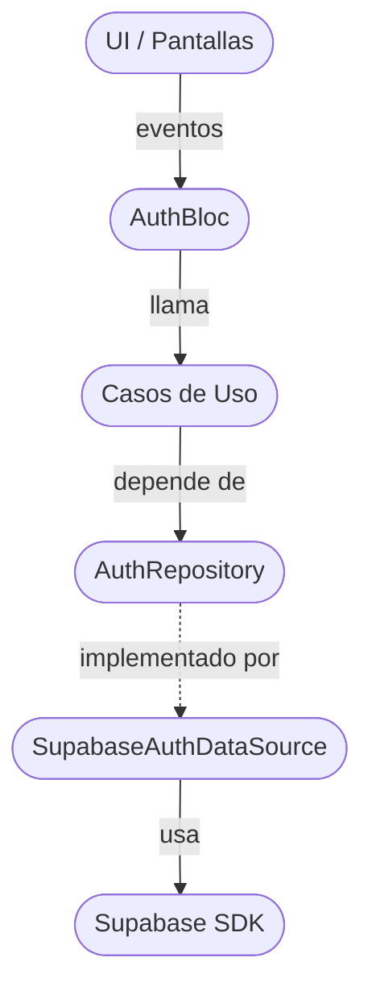

# Laboratorio 5: Flujo de login

<!-- tags: Clean Architecture, AuthRepository, SignInUseCase, SupabaseAuthDataSource, LoginBloc, AuthUser, signInWithPassword, signUp, tabla profiles, Null check operator used on a null value -->

En este laboratorio vas a implementar autenticación real usando `Supabase` como backend, pero organizada bajo los principios de `Clean Architecture`. El objetivo es que la lógica de negocio quede completamente desacoplada del proveedor de autenticación.

Al finalizar, tu app tendrá dos features completas: `registro` y `login`, con pantallas, BloC, casos de uso, repositorios y fuentes de datos bien separados.

Necesitas un proyecto de Supabase con el cliente ya inicializado, conocer el patrón `Bloc` y las capas de Clean Architecture (dominio, datos y presentación).

## ¿Por qué Clean Architecture aquí?

Imagina que hoy usas Supabase, pero mañana tu cliente decide migrar a Firebase. Con Clean Architecture, el único archivo que cambiarías sería el `data source`. El resto de la app (BloC, casos de uso, UI) no necesita tocarse.



La capa de dominio (Casos de Uso y AuthRepository) no sabe nada de Supabase. Sólo habla en términos de tu negocio: `signIn`, `signUp`, `signOut`.

## Estructura de carpetas

Vas a crear dos features dentro de `lib/features/`: `register` y `login`. Ambas comparten la misma lógica de dominio (`auth`), pero tienen su propia UI y BloC.

```bash
lib/
├── features/
│   ├── auth/
│   │   ├── domain/
│   │   │   ├── entities/
│   │   │   │   └── auth_user.dart
│   │   │   ├── repository/
│   │   │   │   └── auth_repository.dart
│   │   │   └── usecases/
│   │   │       ├── sign_in_usecase.dart
│   │   │       └── sign_up_usecase.dart
│   │   └── data/
│   │       ├── repository/
│   │       │   └── auth_repository_impl.dart
│   │       └── source/
│   │           └── supabase_auth_data_source.dart
│   ├── login/
│   │   └── ui/
│   │       ├── bloc/
│   │       │   ├── login_bloc.dart
│   │       │   ├── login_event.dart
│   │       │   └── login_state.dart
│   │       └── screens/
│   │           └── login_screen.dart
│   └── register/
│       └── ui/
│           ├── bloc/
│           │   ├── register_bloc.dart
│           │   ├── register_event.dart
│           │   └── register_state.dart
│           └── screens/
│               └── register_screen.dart
└── main.dart
```

`auth/` contiene todo lo reutilizable: entidad, repositorio abstracto, casos de uso e implementación concreta. Las features `login/` y `register/` sólo tienen UI y BloC propios.

## Dependencias requeridas

Agrega en tu `pubspec.yaml` y ejecuta `flutter pub get`:

```yaml
dependencies:
  flutter_bloc: ^9.1.1
  supabase_flutter: ^2.10.1
```

Inicializa Supabase en `main.dart` con `await Supabase.initialize(url: ..., anonKey: ...)` antes de llamar a `runApp`. Encuentra tus credenciales en el dashboard de tu proyecto en `Project Settings > API`.

## Referencia del SDK

Lo único que necesitas del SDK vive en `SupabaseAuthDataSource`. Todos los métodos devuelven un `AuthResponse` con `user` y `session`, y lanzan `AuthException` si algo falla:

```dart
final signInRes = await _client.auth.signInWithPassword(email: email, password: password);
final signUpRes = await _client.auth.signUp(email: email, password: password);
await _client.auth.signOut();
```

- `user` es `null` si la operación no produjo un usuario: valídalo antes de usar `user!` y lanza una excepción propia, o verás `Null check operator used on a null value`.
- Con la confirmación de correo activada, `signUp` devuelve un `user` pero `session` es `null`: el usuario existe, pero no puede iniciar sesión hasta confirmar. Para este laboratorio desactívala en `Authentication > Providers > Email`.
- El `AuthUser` se arma con el `id` y el `email` de ese `user`.

## Dominio · Entidad

`lib/features/auth/domain/entities/auth_user.dart`

Tu modelo de usuario autenticado. No es el objeto de Supabase, es tu propio concepto de negocio. Tiene `id` y `email`.

```dart
class AuthUser {
  // TODO
}
```

## Dominio · Repositorio abstracto

`lib/features/auth/domain/repository/auth_repository.dart`

Define el contrato que toda implementación debe cumplir. Nadie en esta capa sabe si lo implementa Supabase, Firebase o un mock.

```dart
abstract class AuthRepository {
  Future<AuthUser> signIn({
    required String email,
    required String password,
  });

  // TODO: signUp

  // TODO: signOut
}
```

## Dominio · Casos de uso

`lib/features/auth/domain/usecases/sign_in_usecase.dart`

Cada caso de uso hace exactamente una cosa. Recibe el repositorio y expone un método `call`.

```dart
class SignInUseCase {
  // TODO
}
```

`lib/features/auth/domain/usecases/sign_up_usecase.dart`

```dart
class SignUpUseCase {
  // TODO
}
```

## Datos · Data Source

`lib/features/auth/data/source/supabase_auth_data_source.dart`

Aquí sí vive el conocimiento de Supabase. Recibe un `SupabaseClient` y hace las llamadas reales al SDK. Convierte la respuesta de Supabase en un `AuthUser`.

```dart
class SupabaseAuthDataSource {
  final SupabaseClient _client;

  SupabaseAuthDataSource(this._client);

  Future<AuthUser> signIn({
    required String email,
    required String password,
  }) async {
    // TODO
  }

  // TODO: signUp

  // TODO: signOut
}
```

## Datos · Repository Impl

`lib/features/auth/data/repository/auth_repository_impl.dart`

Implementa el contrato de dominio delegando en el data source. Es el puente entre las dos capas.

```dart
class AuthRepositoryImpl implements AuthRepository {
  final SupabaseAuthDataSource _dataSource;

  AuthRepositoryImpl(this._dataSource);

  @override
  Future<AuthUser> signIn({
    required String email,
    required String password,
  }) {
    // TODO
  }

  // TODO: signUp

  // TODO: signOut
}
```

## Login · Eventos y Estados

`lib/features/login/ui/bloc/login_event.dart`

Los eventos representan intenciones del usuario.

```dart
abstract class LoginEvent {}

class LoginSubmitted extends LoginEvent {
  // TODO: email y password
}
```

`lib/features/login/ui/bloc/login_state.dart`

Los estados cubren todos los momentos posibles del flujo de login.

```dart
abstract class LoginState {}

class LoginInitial extends LoginState {}

// TODO: LoginLoading

// TODO: LoginSuccess (con AuthUser)

// TODO: LoginFailure (con mensaje de error)
```

## Login · BloC

`lib/features/login/ui/bloc/login_bloc.dart`

Recibe el `SignInUseCase` y maneja el evento `LoginSubmitted` emitiendo los estados correspondientes.

```dart
class LoginBloc extends Bloc<LoginEvent, LoginState> {
  final SignInUseCase _signInUseCase;

  LoginBloc(this._signInUseCase) : super(LoginInitial()) {
    on<LoginSubmitted>(_onLoginSubmitted);
  }

  Future<void> _onLoginSubmitted(
    LoginSubmitted event,
    Emitter<LoginState> emit,
  ) async {
    // TODO
  }
}
```

## Login · Pantalla

`lib/features/login/ui/screens/login_screen.dart`

Usa `BlocProvider` para proveer el `LoginBloc` y `BlocBuilder` para reaccionar a cada estado. En carga muestra un `CircularProgressIndicator`, en fallo un texto de error, en éxito navega a la pantalla principal. El `create:` del `BlocProvider` es el único lugar donde se ensambla la cadena de capas, de la más externa a la más interna.

```dart
class LoginScreen extends StatelessWidget {
  const LoginScreen({super.key});

  @override
  Widget build(BuildContext context) {
    return BlocProvider(
      create: (_) => LoginBloc(/* TODO: SignInUseCase(AuthRepositoryImpl(SupabaseAuthDataSource(...))) */),
      child: const _LoginView(),
    );
  }
}

class _LoginView extends StatefulWidget {
  // TODO
}
```

## Goals del laboratorio

- Goal 1 · Completa la entidad `AuthUser` con sus campos y constructor.
- Goal 2 · Completa `AuthRepository` con los métodos `signUp` y `signOut`.
- Goal 3 · Implementa `SignInUseCase` y `SignUpUseCase` con su método `call`.
- Goal 4 · Implementa los métodos `signUp` y `signOut` en `SupabaseAuthDataSource`. Recuerda convertir la respuesta de Supabase en un `AuthUser`.
- Goal 5 · Completa `AuthRepositoryImpl` delegando cada método en `_dataSource`.
- Goal 6 · Completa los eventos y estados de login. Implementa el handler en `LoginBloc` emitiendo `LoginLoading`, `LoginSuccess` o `LoginFailure` según corresponda.
- Goal 7 · Completa `LoginScreen`: agrega los `TextFormField` de email y password, el botón que despacha `LoginSubmitted`, y el `BlocBuilder` que reacciona a cada estado.
- Goal 8 · Crea desde cero los archivos de la feature `register`: eventos, estados, `RegisterBloc` con `SignUpUseCase`, y `RegisterScreen`. Valida que las contraseñas coincidan antes de despachar el evento.
- Goal 9 · Configura la navegación entre `LoginScreen` y `RegisterScreen`. Desde login un botón lleva a registro, y desde registro un botón vuelve a login.
- Goal 10 · Agrega un campo `username` al formulario de registro. Luego de un `signUp` exitoso, inserta ese username en la tabla `profiles` de Supabase. Extiende `SupabaseAuthDataSource` con un método `createProfile` para esto.

## Tabla profiles (Goal 10)

Créala en el `SQL Editor` de Supabase. Cada perfil apunta al usuario de `Auth` que lo creó:

```sql
create table profiles (
  id uuid primary key references auth.users(id) on delete cascade,
  username text not null
);
```

Una tabla creada por SQL nace con `Row Level Security` desactivado, así que el `insert` funciona sin políticas. El insert desde Dart es:

```dart
await _client.from('profiles').insert({'id': userId, 'username': username});
```

## Criterios de entrega

- La app compila y corre sin errores en modo debug.
- El registro crea un usuario real en tu proyecto de Supabase, verificable en el dashboard.
- El login autentica al usuario y muestra su email en la pantalla de destino.
- La estructura de carpetas respeta exactamente la definida en este laboratorio.
- `AuthRepository` es abstracto · `AuthRepositoryImpl` es la implementación concreta · el dominio y el `LoginBloc` nunca importan nada de `data/`: solo el `create:` del `BlocProvider` conoce las clases concretas.
