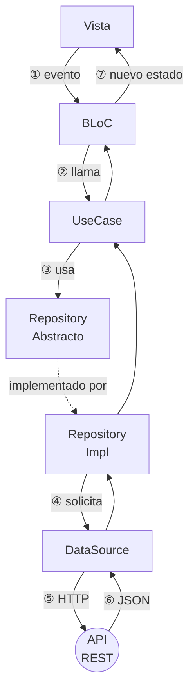

# Clean Architecture con BLoC

<!-- tags: Clean Architecture, UseCase, Repository abstracto, RepositoryImpl, DataSource, inversión de dependencias, capa de dominio, quién crea las dependencias, por qué separar en capas -->

En las dos lecciones anteriores, `ProductsBloc` recibía un `ProductsRepository` directo por constructor: el `Bloc` hablaba con una sola clase que sabía pedir productos y filtrarlos. Esa arquitectura funciona, pero mezcla dos responsabilidades en un solo lugar — *qué* se necesita y *cómo* se consigue — y no dice nada sobre quién puede depender de quién. **Clean Architecture** es un conjunto de reglas para separar mejor esa cadena. Esta lección es puramente conceptual, sin código: es el mapa antes de verlo escrito en Dart en la siguiente lección.

La regla fundamental del patrón: **las capas externas dependen de las internas, nunca al revés.** El dominio no sabe nada del mundo exterior.

## Las tres capas

```svg
<svg xmlns="http://www.w3.org/2000/svg" width="520" height="520" font-family="Roboto, Arial, sans-serif" style="display:block;margin:0 auto;">
  <defs>
    <marker id="dep" markerWidth="8" markerHeight="8" refX="6" refY="3" orient="auto">
      <path d="M0,0 L0,6 L8,3 z" fill="#555"/>
    </marker>
  </defs>

  <!-- Outer ring: Infraestructura -->
  <circle cx="260" cy="265" r="238" fill="#FFA726" fill-opacity="0.08" stroke="#FFA726" stroke-width="2"/>

  <!-- Middle ring: Aplicación -->
  <circle cx="260" cy="265" r="152" fill="#42A5F5" fill-opacity="0.09" stroke="#42A5F5" stroke-width="2"/>

  <!-- Inner circle: Dominio -->
  <circle cx="260" cy="265" r="70" fill="#66BB6A" fill-opacity="0.18" stroke="#66BB6A" stroke-width="2.5"/>

  <!-- === DOMINIO (inner) === -->
  <text x="260" y="219" text-anchor="middle" fill="#66BB6A" font-size="10" font-weight="bold" letter-spacing="1">DOMINIO · PURO</text>
  <text x="260" y="252" text-anchor="middle" fill="#66BB6A" font-size="15" font-weight="bold">UseCase</text>
  <text x="260" y="273" text-anchor="middle" fill="#66BB6A" font-size="12">Repository</text>
  <text x="260" y="291" text-anchor="middle" fill="#66BB6A" font-size="12">Abstracto</text>

  <!-- === APLICACIÓN (middle ring) === -->
  <text x="260" y="138" text-anchor="middle" fill="#42A5F5" font-size="10" font-weight="bold" letter-spacing="1">APLICACIÓN</text>
  <text x="260" y="168" text-anchor="middle" fill="#42A5F5" font-size="19" font-weight="bold">BLoC</text>

  <!-- === INFRAESTRUCTURA (outer ring) === -->
  <!-- Layer label at top -->
  <text x="260" y="42" text-anchor="middle" fill="#FFA726" font-size="10" font-weight="bold" letter-spacing="1">INFRAESTRUCTURA</text>

  <!-- Vista / Widget at top -->
  <text x="260" y="78" text-anchor="middle" fill="#FFA726" font-size="15" font-weight="bold">Vista / Widget</text>

  <!-- RepositoryImpl at bottom-left (r≈195, angle=225° visual) -->
  <!-- x = 260 + 195·sin(225°) ≈ 260 − 138 = 122 -->
  <!-- y = 265 − 195·cos(225°) ≈ 265 + 138 = 403 -->
  <text x="108" y="398" text-anchor="middle" fill="#FFA726" font-size="14" font-weight="bold">Repository</text>
  <text x="108" y="416" text-anchor="middle" fill="#FFA726" font-size="13">Impl</text>

  <!-- DataSource at bottom-right (r≈195, angle=135° visual) -->
  <!-- x = 260 + 195·sin(135°) ≈ 260 + 138 = 398 -->
  <!-- y = 265 − 195·cos(135°) ≈ 265 + 138 = 403 -->
  <text x="412" y="398" text-anchor="middle" fill="#FFA726" font-size="14" font-weight="bold">Data</text>
  <text x="412" y="416" text-anchor="middle" fill="#FFA726" font-size="13">Source</text>

  <!-- Dependency arrows (pointing inward = toward center) -->
  <!-- Vista → BLoC -->
  <line x1="260" y1="88" x2="260" y2="148" stroke="#555" stroke-width="1.5" stroke-dasharray="5,3" marker-end="url(#dep)"/>
  <!-- BLoC → Domain top -->
  <line x1="260" y1="178" x2="260" y2="192" stroke="#555" stroke-width="1.5" stroke-dasharray="5,3" marker-end="url(#dep)"/>
  <!-- RepoImpl → Domain (lower-left edge of inner circle) -->
  <!-- inner circle edge at 225°: x=260−70·sin(45°)≈211, y=265+70·cos(45°)≈314 -->
  <line x1="172" y1="400" x2="218" y2="317" stroke="#555" stroke-width="1.5" stroke-dasharray="5,3" marker-end="url(#dep)"/>
  <!-- DataSource → RepoImpl (just showing connection within outer ring) -->
  <line x1="348" y1="400" x2="302" y2="317" stroke="#555" stroke-width="1.5" stroke-dasharray="5,3" marker-end="url(#dep)"/>

  <!-- Bottom note -->
  <text x="260" y="510" text-anchor="middle" fill="#555" font-size="11">Las dependencias apuntan hacia el centro</text>
</svg>
```

Las capas se leen de adentro hacia afuera. Cuanto más al centro, más pura y estable es la capa.

- **Dominio (núcleo)** — No depende de nadie. Solo lógica de negocio. Aquí viven el `UseCase` y el `Repository` abstracto.
- **Aplicación** — Contiene el `BLoC`. Solo conoce el Dominio.
- **Infraestructura (exterior)** — Contiene la `Vista`, el `RepositoryImpl` y el `DataSource`. Es la capa que toca el mundo real: HTTP, bases de datos, el framework de UI.

En carpetas esto se ve como `domain/`, `data/` (`RepositoryImpl` y `DataSource`) y `ui/` (`BLoC` y `Vista`). El anillo exterior del gráfico agrupa `data/` y la Vista porque ambas tocan el mundo real.

## Flujo de una petición

Cuando el usuario realiza una acción, los datos viajan así:



El BLoC nunca llama directamente al `RepositoryImpl`. Solo conoce la abstracción. Eso es la **inversión de dependencias**: la pieza que decide *qué* necesita (el dominio) no depende de la pieza que decide *cómo* conseguirlo (la infraestructura) — es al revés.

## Qué es cada pieza

**Entidad.** El objeto de negocio que viaja por todas las capas — en el catálogo de productos sería `Product`. No conoce Flutter, HTTP ni el `Bloc`.

**Repository abstracto.** El contrato que el dominio necesita: qué operaciones existen, no cómo se resuelven. Es una interfaz, no una implementación. El `UseCase` depende de esta abstracción, nunca del `RepositoryImpl`. Gracias a esto, la fuente de datos —HTTP, una base local, una caché— puede cambiar sin tocar una sola línea del dominio.

**UseCase.** Encapsula una acción de negocio concreta: un `UseCase` es una responsabilidad. Recibe el `Repository` abstracto por constructor y no importa nada más — ni HTTP, ni el `Bloc`, ni Flutter. Es la pieza más fácil de probar de toda la cadena, porque solo depende de una interfaz.

**DataSource.** Hace la llamada HTTP real y convierte la respuesta en entidades. Es la única clase de toda la cadena que sabe que existe HTTP.

**RepositoryImpl.** Implementa el contrato del `Repository` abstracto y recibe el `DataSource` por constructor. Es el puente entre el dominio y los datos: el lugar donde se decide de dónde salen realmente, y donde se podrían combinar varias fuentes (red y caché, por ejemplo) sin que el dominio se entere.

**BLoC.** Recibe eventos de la vista, invoca el `UseCase` y emite estados. No sabe nada de HTTP ni de cómo se consiguen los datos — eso es justamente lo que gana al hablar con un `UseCase` en vez de con un `Repository` directo.

**Vista.** Escucha los estados del `BLoC` y renderiza la UI. No contiene lógica de negocio: si una regla de negocio termina viviendo en la vista, esa regla se volvió imposible de probar sin levantar un widget.

## Quién crea las dependencias

Ninguna capa crea a la capa de la que depende: alguien de afuera las construye y se las entrega ya armadas. Ese ensamblaje ocurre en **un solo lugar**, normalmente donde se arma el árbol de widgets: ahí se crea el `DataSource`, se envuelve en el `RepositoryImpl`, ese se envuelve en el `UseCase`, y el `UseCase` se le entrega al `BLoC`.

Es la única línea de toda la app que conoce a la vez la implementación concreta del repositorio y la del `DataSource`. Cambiar la fuente de datos — pasar de una API REST a una base local, por ejemplo — es cambiar esa línea, y nada más.

## Resumen: quién conoce a quién

```svg
<svg xmlns="http://www.w3.org/2000/svg" width="580" height="210" font-family="Roboto, Arial, sans-serif" font-size="13" style="display:block;margin:0 auto;">
  <defs>
    <marker id="arr" markerWidth="8" markerHeight="8" refX="6" refY="3" orient="auto">
      <path d="M0,0 L0,6 L8,3 z" fill="#777"/>
    </marker>
    <marker id="arr-dash" markerWidth="8" markerHeight="8" refX="6" refY="3" orient="auto">
      <path d="M0,0 L0,6 L8,3 z" fill="#66BB6A"/>
    </marker>
  </defs>

  <!-- Vista -->
  <rect x="10" y="75" width="80" height="52" rx="8" fill="#FFA726"/>
  <text x="50" y="98" text-anchor="middle" fill="white" font-weight="bold" font-size="12">Vista</text>
  <text x="50" y="116" text-anchor="middle" fill="white" font-size="10">Widget</text>
  <line x1="90" y1="101" x2="110" y2="101" stroke="#777" stroke-width="2" marker-end="url(#arr)"/>

  <!-- BLoC -->
  <rect x="110" y="75" width="80" height="52" rx="8" fill="#42A5F5"/>
  <text x="150" y="105" text-anchor="middle" fill="white" font-weight="bold" font-size="12">BLoC</text>
  <line x1="190" y1="101" x2="210" y2="101" stroke="#777" stroke-width="2" marker-end="url(#arr)"/>

  <!-- Domain box -->
  <rect x="205" y="55" width="200" height="95" rx="10" fill="none" stroke="#66BB6A" stroke-width="2" stroke-dasharray="6,3"/>
  <text x="305" y="48" text-anchor="middle" fill="#66BB6A" font-size="10" font-weight="bold">DOMINIO · PURO</text>

  <!-- UseCase -->
  <rect x="215" y="72" width="80" height="52" rx="8" fill="#66BB6A"/>
  <text x="255" y="96" text-anchor="middle" fill="white" font-weight="bold" font-size="12">UseCase</text>
  <text x="255" y="113" text-anchor="middle" fill="white" font-size="10">una responsabilidad</text>
  <line x1="295" y1="101" x2="315" y2="101" stroke="#777" stroke-width="2" marker-end="url(#arr)"/>

  <!-- RepositoryAbstracto -->
  <rect x="315" y="72" width="80" height="52" rx="8" fill="#66BB6A"/>
  <text x="355" y="93" text-anchor="middle" fill="white" font-weight="bold" font-size="11">Repository</text>
  <text x="355" y="108" text-anchor="middle" fill="white" font-size="11">Abstracto</text>
  <text x="355" y="122" text-anchor="middle" fill="white" font-size="9">interface</text>

  <!-- dashed arrow to impl -->
  <line x1="395" y1="101" x2="415" y2="101" stroke="#66BB6A" stroke-width="2" stroke-dasharray="5,3" marker-end="url(#arr-dash)"/>

  <!-- RepositoryImpl -->
  <rect x="415" y="75" width="80" height="52" rx="8" fill="#FFA726"/>
  <text x="455" y="97" text-anchor="middle" fill="white" font-weight="bold" font-size="11">Repository</text>
  <text x="455" y="113" text-anchor="middle" fill="white" font-size="11">Impl</text>
  <line x1="495" y1="101" x2="515" y2="101" stroke="#777" stroke-width="2" marker-end="url(#arr)"/>

  <!-- DataSource -->
  <rect x="515" y="75" width="55" height="52" rx="8" fill="#FFA726"/>
  <text x="542" y="97" text-anchor="middle" fill="white" font-weight="bold" font-size="11">Data</text>
  <text x="542" y="113" text-anchor="middle" fill="white" font-size="11">Source</text>

  <!-- Legend -->
  <rect x="10" y="170" width="12" height="12" rx="2" fill="#66BB6A"/>
  <text x="28" y="181" fill="#aaa" font-size="11">Dominio puro (sin Flutter, sin HTTP)</text>
  <rect x="240" y="170" width="12" height="12" rx="2" fill="#42A5F5"/>
  <text x="258" y="181" fill="#aaa" font-size="11">Aplicación (BLoC)</text>
  <rect x="370" y="170" width="12" height="12" rx="2" fill="#FFA726"/>
  <text x="388" y="181" fill="#aaa" font-size="11">Infraestructura</text>

  <!-- dashed line legend -->
  <line x1="10" y1="198" x2="35" y2="198" stroke="#66BB6A" stroke-width="2" stroke-dasharray="5,3"/>
  <text x="42" y="202" fill="#aaa" font-size="11">implementa (Impl cumple el contrato abstracto)</text>
</svg>
```

- `Vista` solo habla con `BLoC` — nada más.
- `BLoC` solo habla con `UseCase`, jamás con `RepositoryImpl`.
- `UseCase` solo conoce `Repository` abstracto — no sabe si los datos vienen de HTTP o de una base de datos.
- `RepositoryImpl` cumple el contrato del dominio e invoca al `DataSource`.
- La flecha punteada verde indica implementación: `RepositoryImpl` satisface la interfaz que el dominio define.

En el *Laboratorio 4*, cada una de estas piezas se escribe en Dart, aplicada a un buscador de música.
