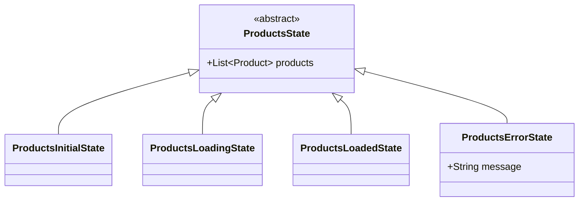
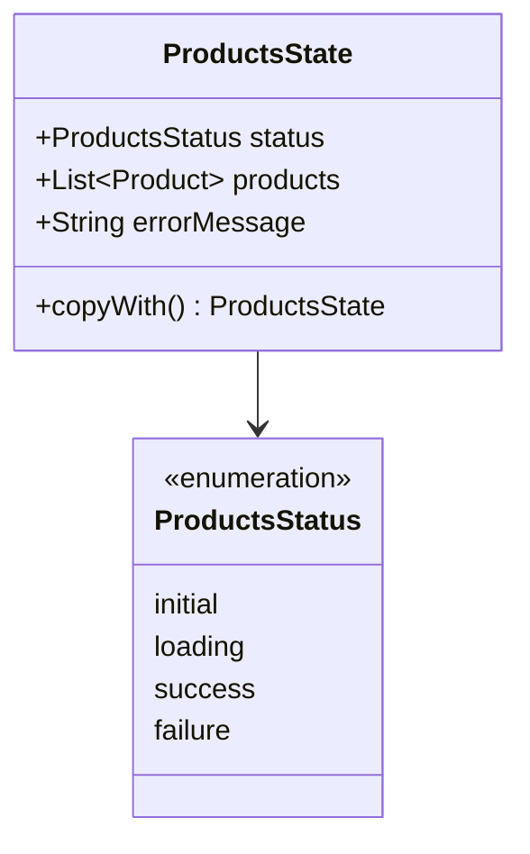

# State Management Strategies

<!-- tags: estado base, copyWith, clase padre del estado, ProductsStatus, conservar la lista mientras carga, on<Evento> y emit, super.products, state.products, estado único con copyWith, enum de estado, qué va en la clase padre, required super.products -->

Un `Bloc` decide qué estados existen, y cada estado decide qué datos viajan con él. Esa segunda decisión es la que define cómo se comporta la pantalla mientras carga o cuando algo falla. En esta lección vemos dos estrategias para tomarla sobre un mismo ejemplo, el catálogo de una tienda, y solo miramos la capa de `Bloc`: estados, eventos y el `Bloc` mismo. La vista y el acceso a datos no cambian de una estrategia a otra.

## El ejemplo: catálogo de una tienda

La pantalla lista los productos de una tienda. Cada `Product` tiene `id`, `name`, `price` y `category`, y la lista llega de un `ProductsRepository` con un método `getProducts()`. De dónde salen esos datos —red, caché, una base local— no importa aquí: al `Bloc` solo le interesa la lista que regresa.

La pantalla pasa por cuatro momentos: arranca sin nada, carga, muestra la lista y a veces falla. Además tiene un botón de recargar. La pregunta que ordena toda la lección es esta: **si el usuario ya ve cuatro productos y toca recargar, ¿qué ve mientras llega la respuesta? ¿Y si la recarga falla?**

Si cada estado trajera solo sus propios datos —la lista únicamente en el estado de «cargado»—, al recargar la pantalla quedaría en blanco y un error de red borraría una lista que el usuario ya tenía. Las dos estrategias de esta lección lo evitan. Lo que cambia entre ellas es cómo describen el estado:

```svg
<svg xmlns="http://www.w3.org/2000/svg" width="720" height="365" viewBox="0 0 720 365" font-family="Roboto, Arial, sans-serif" style="display:block;margin:0 auto;max-width:100%;height:auto;">
  <defs>
    <clipPath id="sms-cell"><rect x="0" y="0" width="160" height="150" rx="10"/></clipPath>
    <marker id="sms-arrow" markerWidth="8" markerHeight="8" refX="6" refY="3" orient="auto"><path d="M0,0 L0,6 L8,3 z" fill="#888"/></marker>
    <g id="sms-bar">
      <rect x="0" y="0" width="160" height="150" fill="#FFFFFF"/>
      <rect x="0" y="0" width="160" height="24" fill="#1976D2"/>
      <text x="10" y="16" fill="#FFFFFF" font-size="10" font-weight="bold">Productos</text>
    </g>
    <g id="sms-list" font-size="10" fill="#212121">
      <rect x="10" y="36" width="18" height="18" rx="4" fill="#EF5350"/>
      <text x="36" y="49">Manzana roja</text>
      <rect x="10" y="64" width="18" height="18" rx="4" fill="#FFA726"/>
      <text x="36" y="77">Jugo de naranja</text>
      <rect x="10" y="92" width="18" height="18" rx="4" fill="#90CAF9"/>
      <text x="36" y="105">Leche entera</text>
      <rect x="10" y="120" width="18" height="18" rx="4" fill="#4FC3F7"/>
      <text x="36" y="133">Agua con gas</text>
    </g>
  </defs>

  <text x="250" y="22" text-anchor="middle" fill="#888" font-size="10">con la lista cargada</text>
  <text x="430" y="22" text-anchor="middle" fill="#888" font-size="10">el usuario recarga</text>
  <text x="610" y="22" text-anchor="middle" fill="#888" font-size="10">la recarga falla</text>

  <text x="12" y="106" fill="#888" font-size="12" font-weight="bold">La pantalla</text>
  <text x="12" y="122" fill="#888" font-size="10">igual en las dos</text>

  <g transform="translate(170,35)">
    <g clip-path="url(#sms-cell)">
      <use href="#sms-bar"/>
      <use href="#sms-list"/>
    </g>
    <rect x="0" y="0" width="160" height="150" rx="10" fill="none" stroke="#9E9E9E"/>
  </g>
  <g transform="translate(350,35)">
    <g clip-path="url(#sms-cell)">
      <use href="#sms-bar"/>
      <rect x="0" y="24" width="160" height="3" fill="#BBDEFB"/>
      <rect x="0" y="24" width="60" height="3" fill="#1976D2"/>
      <use href="#sms-list"/>
    </g>
    <rect x="0" y="0" width="160" height="150" rx="10" fill="none" stroke="#9E9E9E"/>
  </g>
  <g transform="translate(530,35)">
    <g clip-path="url(#sms-cell)">
      <use href="#sms-bar"/>
      <use href="#sms-list"/>
      <rect x="8" y="114" width="144" height="28" rx="4" fill="#323232"/>
      <text x="18" y="132" fill="#FFFFFF" font-size="10">Sin conexión</text>
    </g>
    <rect x="0" y="0" width="160" height="150" rx="10" fill="none" stroke="#9E9E9E"/>
  </g>

  <line x1="332" y1="110" x2="345" y2="110" stroke="#888" stroke-width="1.5" marker-end="url(#sms-arrow)"/>
  <line x1="512" y1="110" x2="525" y2="110" stroke="#888" stroke-width="1.5" marker-end="url(#sms-arrow)"/>

  <text x="12" y="226" fill="#42A5F5" font-size="12" font-weight="bold">Estrategia 1</text>
  <text x="12" y="242" fill="#888" font-size="10">Clase padre con subclases</text>

  <rect x="170" y="200" width="160" height="56" rx="8" fill="#42A5F5" fill-opacity="0.08" stroke="#42A5F5" stroke-opacity="0.6"/>
  <text x="250" y="217" text-anchor="middle" fill="#42A5F5" font-size="10" font-weight="bold" font-family="monospace">ProductsLoadedState</text>
  <text x="250" y="232" text-anchor="middle" fill="#888" font-size="9" font-family="monospace">products: 4 productos</text>

  <rect x="350" y="200" width="160" height="56" rx="8" fill="#42A5F5" fill-opacity="0.08" stroke="#42A5F5" stroke-opacity="0.6"/>
  <text x="430" y="217" text-anchor="middle" fill="#42A5F5" font-size="10" font-weight="bold" font-family="monospace">ProductsLoadingState</text>
  <text x="430" y="232" text-anchor="middle" fill="#888" font-size="9" font-family="monospace">products: los mismos 4</text>

  <rect x="530" y="200" width="160" height="56" rx="8" fill="#42A5F5" fill-opacity="0.08" stroke="#42A5F5" stroke-opacity="0.6"/>
  <text x="610" y="217" text-anchor="middle" fill="#42A5F5" font-size="10" font-weight="bold" font-family="monospace">ProductsErrorState</text>
  <text x="610" y="232" text-anchor="middle" fill="#888" font-size="9" font-family="monospace">products: los mismos 4</text>
  <text x="610" y="246" text-anchor="middle" fill="#888" font-size="9" font-family="monospace">message: 'Sin conexión'</text>

  <text x="12" y="306" fill="#66BB6A" font-size="12" font-weight="bold">Estrategia 2</text>
  <text x="12" y="322" fill="#888" font-size="10">Estado único con copyWith</text>

  <rect x="170" y="272" width="160" height="78" rx="8" fill="#66BB6A" fill-opacity="0.08" stroke="#66BB6A" stroke-opacity="0.6"/>
  <text x="250" y="289" text-anchor="middle" fill="#66BB6A" font-size="10" font-weight="bold" font-family="monospace">ProductsState</text>
  <text x="250" y="304" text-anchor="middle" fill="#888" font-size="9" font-family="monospace">status: success</text>
  <text x="250" y="318" text-anchor="middle" fill="#888" font-size="9" font-family="monospace">products: 4 productos</text>

  <rect x="350" y="272" width="160" height="78" rx="8" fill="#66BB6A" fill-opacity="0.08" stroke="#66BB6A" stroke-opacity="0.6"/>
  <text x="430" y="289" text-anchor="middle" fill="#66BB6A" font-size="10" font-weight="bold" font-family="monospace">ProductsState</text>
  <text x="430" y="304" text-anchor="middle" fill="#888" font-size="9" font-family="monospace">status: loading</text>
  <text x="430" y="318" text-anchor="middle" fill="#888" font-size="9" font-family="monospace">products: los mismos 4</text>

  <rect x="530" y="272" width="160" height="78" rx="8" fill="#66BB6A" fill-opacity="0.08" stroke="#66BB6A" stroke-opacity="0.6"/>
  <text x="610" y="289" text-anchor="middle" fill="#66BB6A" font-size="10" font-weight="bold" font-family="monospace">ProductsState</text>
  <text x="610" y="304" text-anchor="middle" fill="#888" font-size="9" font-family="monospace">status: failure</text>
  <text x="610" y="318" text-anchor="middle" fill="#888" font-size="9" font-family="monospace">products: los mismos 4</text>
  <text x="610" y="332" text-anchor="middle" fill="#888" font-size="8.5" font-family="monospace">errorMessage: 'Sin conexión'</text>
</svg>
```

La fila de arriba es lo que ve el usuario, y es idéntica con las dos estrategias. Debajo está el estado que produce cada pantalla: en la primera estrategia, el momento lo dice **el tipo** del estado; en la segunda, lo dice **un campo**.

## Estrategia 1 · Clase padre con subclases

Llamamos **estado base** a lo que la pantalla muestra sin importar el momento en que esté. En el catálogo, es la lista de productos. Ese dato se declara una sola vez, en la clase padre, y cada momento de la pantalla es una subclase que lo hereda.

```dart
abstract class ProductsState {
  final List<Product> products;

  ProductsState({required this.products});
}

class ProductsInitialState extends ProductsState {
  ProductsInitialState() : super(products: const []);
}

class ProductsLoadingState extends ProductsState {
  ProductsLoadingState({required super.products});
}

class ProductsLoadedState extends ProductsState {
  ProductsLoadedState({required super.products});
}

class ProductsErrorState extends ProductsState {
  final String message;

  ProductsErrorState(this.message, {required super.products});
}
```



- `products` está en `ProductsState`, así que un `ProductsLoadingState` o un `ProductsErrorState` también saben qué productos hay.
- `required super.products` le pasa el valor directo al constructor del padre. Es la forma corta de `ProductsLoadingState({required List<Product> products}) : super(products: products);`.
- Solo `ProductsInitialState` fija la lista, vacía: es el único momento en que de verdad no hay productos.
- `message` se queda en `ProductsErrorState`, porque solo tiene sentido cuando algo falló.

El `required` en cada subclase es deliberado. Obliga a quien emite un estado a decidir qué lista lleva. Si la clase padre tuviera un valor por defecto (`this.products = const []`), olvidar pasarla compilaría sin quejarse y la lista se vaciaría en silencio.

## El Bloc con subclases

Un solo evento sirve para la primera carga y para recargar. Los eventos son los mismos en las dos estrategias:

```dart
abstract class ProductsEvent {}

class LoadProductsEvent extends ProductsEvent {}
```

Cada evento es una clase. Todas heredan de `ProductsEvent`, que es el tipo de evento que acepta el `Bloc`: así la vista puede lanzar cualquiera de ellos, y el `Bloc` sabe exactamente cuáles existen.

```dart
class ProductsBloc extends Bloc<ProductsEvent, ProductsState> {
  final ProductsRepository _repository;

  ProductsBloc(this._repository) : super(ProductsInitialState()) {
    on<LoadProductsEvent>(_onLoadProducts);
  }

  Future<void> _onLoadProducts(
    LoadProductsEvent event,
    Emitter<ProductsState> emit,
  ) async {
    emit(ProductsLoadingState(products: state.products));
    try {
      final products = await _repository.getProducts();
      emit(ProductsLoadedState(products: products));
    } on Exception catch (e) {
      emit(ProductsErrorState(e.toString(), products: state.products));
    }
  }
}
```

Así se lee un `Bloc`, pieza por pieza:

- `extends Bloc<ProductsEvent, ProductsState>` declara qué eventos recibe y qué estados entrega.
- `super(ProductsInitialState())` es el estado con el que arranca, antes de que llegue cualquier evento.
- `on<LoadProductsEvent>(_onLoadProducts)` dice: «cuando llegue un `LoadProductsEvent`, ejecuta `_onLoadProducts`». Un `Bloc` registra un `on` por cada evento que atiende.
- El manejador recibe el `event` que llegó y un `emit`. Cada `emit(...)` le entrega un estado nuevo a la vista, y un mismo evento puede emitir varios: aquí, primero «cargando» y después el resultado.
- `state` es el estado actual del `Bloc`, el último que se emitió.

`state.products` funciona sin preguntar el tipo ni castear: sea cual sea el estado actual, la lista está declarada en la clase padre. Cada `emit` es una decisión explícita sobre la lista:

| `emit` | Lista que lleva | Por qué |
|---|---|---|
| `ProductsLoadingState` | `state.products` | Mientras carga se sigue viendo lo que ya había |
| `ProductsLoadedState` | `products` | La respuesta nueva reemplaza a la anterior |
| `ProductsErrorState` | `state.products` | Un fallo no borra lo que el usuario ya tenía |

En el `catch`, `state` ya es el `ProductsLoadingState` emitido dos líneas antes, que traía la lista. Por eso la lista sobrevive a los dos saltos: de cargado a cargando y de cargando a error.

## Qué va en la clase padre

El criterio es una pregunta: **¿la pantalla lo sigue mostrando mientras carga o después de un error?** Si la respuesta es sí, va en la clase padre. Si solo tiene sentido en un momento concreto, va en la subclase de ese momento.

| Dato | Dónde | Por qué |
|---|---|---|
| Lista de productos | `ProductsState` | Se dibuja en todos los momentos |
| Categoría elegida en un filtro | `ProductsState` | El filtro sigue marcado mientras carga |
| Mensaje de error | `ProductsErrorState` | Solo existe cuando algo falló |

No conviene subir todo a la clase padre. Si `message` viviera ahí, cada estado tendría que decidir qué hacer con él, y un error viejo podría reaparecer dentro de un `ProductsLoadedState`.

## Estrategia 2 · Estado único con copyWith

En lugar de una subclase por momento, hay **una sola clase de estado**. El momento de la pantalla deja de ser un tipo y pasa a ser un campo, `status`, cuyo valor sale de un `enum`:

```dart
enum ProductsStatus { initial, loading, success, failure }

class ProductsState {
  final ProductsStatus status;
  final List<Product> products;
  final String? errorMessage;

  const ProductsState({
    this.status = ProductsStatus.initial,
    this.products = const [],
    this.errorMessage,
  });

  ProductsState copyWith({
    ProductsStatus? status,
    List<Product>? products,
    String? errorMessage,
  }) {
    return ProductsState(
      status: status ?? this.status,
      products: products ?? this.products,
      errorMessage: errorMessage ?? this.errorMessage,
    );
  }
}
```



- Los cuatro momentos de la pantalla son los cuatro valores de `ProductsStatus`. No hay jerarquía de clases.
- `copyWith` devuelve una copia del estado cambiando solo lo que se le pasa. El `??` significa «si no me lo pasas, conservo el valor actual».
- Los valores por defecto del constructor describen el arranque, así que el estado inicial es simplemente `const ProductsState()`.
- `errorMessage` es `String?` porque existe en todos los momentos, aunque solo tenga sentido en `failure`.

## El Bloc con copyWith

Los eventos son los mismos de la estrategia anterior. Cambia el `Bloc`:

```dart
class ProductsBloc extends Bloc<ProductsEvent, ProductsState> {
  final ProductsRepository _repository;

  ProductsBloc(this._repository) : super(const ProductsState()) {
    on<LoadProductsEvent>(_onLoadProducts);
  }

  Future<void> _onLoadProducts(
    LoadProductsEvent event,
    Emitter<ProductsState> emit,
  ) async {
    emit(state.copyWith(status: ProductsStatus.loading));
    try {
      final products = await _repository.getProducts();
      emit(state.copyWith(status: ProductsStatus.success, products: products));
    } on Exception catch (e) {
      emit(state.copyWith(
        status: ProductsStatus.failure,
        errorMessage: e.toString(),
      ));
    }
  }
}
```

Nadie escribe `state.products`. La lista sobrevive porque `copyWith` conserva todo lo que no se menciona:

| `emit` | Qué cambia | Qué pasa con la lista |
|---|---|---|
| `copyWith(status: loading)` | Solo el estado | Se conserva sola |
| `copyWith(status: success, products: ...)` | Estado y lista | La respuesta nueva la reemplaza |
| `copyWith(status: failure, errorMessage: ...)` | Estado y mensaje | Se conserva sola |

Es la misma pantalla que con subclases, pero la decisión se invierte. Con subclases dices **qué se conserva** (`products: state.products`); con `copyWith` dices **qué cambia**, y lo demás se conserva solo.

Del lado de la vista, la pregunta también cambia de forma: en vez de `state is ProductsLoadingState` se pregunta `state.status == ProductsStatus.loading`, y un `switch (state.status)` obliga a cubrir los cuatro momentos, porque Dart revisa que un `switch` sobre un `enum` sea exhaustivo.
