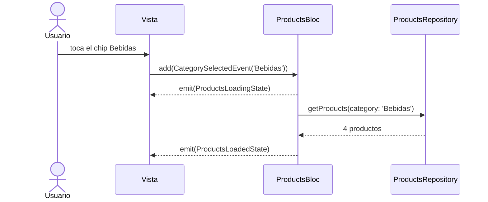

# Vista y BLoC: filtrar por categoría

<!-- tags: CategorySelectedEvent, context.read().add, selectedCategory, context that does not contain a Bloc, ChoiceChip, BlocBuilder, emit, callback onSelected, un evento dos estados, estado base, la vista no decide, filtrar por categoría -->

Seguimos con el catálogo de *State Management Strategies*, con la estrategia de clase padre con subclases: la lista de productos vive en la clase padre del estado. Con el estado único y `copyWith` el recorrido entre la vista y el `Bloc` es exactamente el mismo; solo cambia cómo se emite cada estado. Ahora el usuario puede filtrar tocando una categoría. Esa sola interacción recorre el camino completo entre las dos capas: la vista avisa al `Bloc` con un evento, el `Bloc` emite estados y la vista se redibuja con lo que recibe. De cada paso se muestra solo el código mínimo.

## La interacción

El usuario ve todos los productos con el chip **Todos** marcado y toca **Bebidas**:

```svg
<svg xmlns="http://www.w3.org/2000/svg" width="760" height="420" viewBox="0 0 760 420" font-family="Roboto, Arial, sans-serif" style="display:block;margin:0 auto;max-width:100%;height:auto;">
  <defs>
    <clipPath id="vb-screen"><rect x="0" y="0" width="210" height="300" rx="14"/></clipPath>
    <marker id="vb-arrow" markerWidth="8" markerHeight="8" refX="6" refY="3" orient="auto"><path d="M0,0 L0,6 L8,3 z" fill="#888"/></marker>
    <g id="vb-bar">
      <rect x="0" y="0" width="210" height="300" fill="#FFFFFF"/>
      <rect x="0" y="0" width="210" height="36" fill="#1976D2"/>
      <text x="14" y="23" fill="#FFFFFF" font-size="13" font-weight="bold">Productos</text>
    </g>
    <g id="vb-chips-all" font-size="10" text-anchor="middle">
      <rect x="12" y="46" width="44" height="22" rx="11" fill="#BBDEFB" stroke="#1976D2"/>
      <text x="34" y="61" fill="#0D47A1" font-weight="bold">Todos</text>
      <rect x="62" y="46" width="48" height="22" rx="11" fill="#FFFFFF" stroke="#BDBDBD"/>
      <text x="86" y="61" fill="#424242">Frutas</text>
      <rect x="116" y="46" width="54" height="22" rx="11" fill="#FFFFFF" stroke="#BDBDBD"/>
      <text x="143" y="61" fill="#424242">Bebidas</text>
      <rect x="176" y="46" width="54" height="22" rx="11" fill="#FFFFFF" stroke="#BDBDBD"/>
      <text x="203" y="61" fill="#424242">Lácteos</text>
    </g>
    <g id="vb-chips-drinks" font-size="10" text-anchor="middle">
      <rect x="12" y="46" width="44" height="22" rx="11" fill="#FFFFFF" stroke="#BDBDBD"/>
      <text x="34" y="61" fill="#424242">Todos</text>
      <rect x="62" y="46" width="48" height="22" rx="11" fill="#FFFFFF" stroke="#BDBDBD"/>
      <text x="86" y="61" fill="#424242">Frutas</text>
      <rect x="116" y="46" width="54" height="22" rx="11" fill="#BBDEFB" stroke="#1976D2"/>
      <text x="143" y="61" fill="#0D47A1" font-weight="bold">Bebidas</text>
      <rect x="176" y="46" width="54" height="22" rx="11" fill="#FFFFFF" stroke="#BDBDBD"/>
      <text x="203" y="61" fill="#424242">Lácteos</text>
    </g>
    <g id="vb-list-all">
      <rect x="12" y="90" width="28" height="28" rx="6" fill="#EF5350"/>
      <text x="48" y="103" fill="#212121" font-size="11">Manzana roja</text>
      <text x="48" y="116" fill="#757575" font-size="9">Frutas</text>
      <text x="198" y="103" fill="#424242" font-size="10" text-anchor="end">$2.500</text>
      <line x1="48" y1="123" x2="210" y2="123" stroke="#EEEEEE"/>
      <rect x="12" y="130" width="28" height="28" rx="6" fill="#FFA726"/>
      <text x="48" y="143" fill="#212121" font-size="11">Jugo de naranja</text>
      <text x="48" y="156" fill="#757575" font-size="9">Bebidas</text>
      <text x="198" y="143" fill="#424242" font-size="10" text-anchor="end">$6.900</text>
      <line x1="48" y1="163" x2="210" y2="163" stroke="#EEEEEE"/>
      <rect x="12" y="170" width="28" height="28" rx="6" fill="#90CAF9"/>
      <text x="48" y="183" fill="#212121" font-size="11">Leche entera</text>
      <text x="48" y="196" fill="#757575" font-size="9">Lácteos</text>
      <text x="198" y="183" fill="#424242" font-size="10" text-anchor="end">$4.200</text>
      <line x1="48" y1="203" x2="210" y2="203" stroke="#EEEEEE"/>
      <rect x="12" y="210" width="28" height="28" rx="6" fill="#4FC3F7"/>
      <text x="48" y="223" fill="#212121" font-size="11">Agua con gas</text>
      <text x="48" y="236" fill="#757575" font-size="9">Bebidas</text>
      <text x="198" y="223" fill="#424242" font-size="10" text-anchor="end">$3.100</text>
      <line x1="48" y1="243" x2="210" y2="243" stroke="#EEEEEE"/>
      <rect x="12" y="250" width="28" height="28" rx="6" fill="#FFD54F"/>
      <text x="48" y="263" fill="#212121" font-size="11">Banano</text>
      <text x="48" y="276" fill="#757575" font-size="9">Frutas</text>
      <text x="198" y="263" fill="#424242" font-size="10" text-anchor="end">$1.800</text>
    </g>
    <g id="vb-list-drinks">
      <rect x="12" y="90" width="28" height="28" rx="6" fill="#FFA726"/>
      <text x="48" y="103" fill="#212121" font-size="11">Jugo de naranja</text>
      <text x="48" y="116" fill="#757575" font-size="9">Bebidas</text>
      <text x="198" y="103" fill="#424242" font-size="10" text-anchor="end">$6.900</text>
      <line x1="48" y1="123" x2="210" y2="123" stroke="#EEEEEE"/>
      <rect x="12" y="130" width="28" height="28" rx="6" fill="#4FC3F7"/>
      <text x="48" y="143" fill="#212121" font-size="11">Agua con gas</text>
      <text x="48" y="156" fill="#757575" font-size="9">Bebidas</text>
      <text x="198" y="143" fill="#424242" font-size="10" text-anchor="end">$3.100</text>
      <line x1="48" y1="163" x2="210" y2="163" stroke="#EEEEEE"/>
      <rect x="12" y="170" width="28" height="28" rx="6" fill="#AED581"/>
      <text x="48" y="183" fill="#212121" font-size="11">Gaseosa limón</text>
      <text x="48" y="196" fill="#757575" font-size="9">Bebidas</text>
      <text x="198" y="183" fill="#424242" font-size="10" text-anchor="end">$3.500</text>
      <line x1="48" y1="203" x2="210" y2="203" stroke="#EEEEEE"/>
      <rect x="12" y="210" width="28" height="28" rx="6" fill="#A1887F"/>
      <text x="48" y="223" fill="#212121" font-size="11">Té helado</text>
      <text x="48" y="236" fill="#757575" font-size="9">Bebidas</text>
      <text x="198" y="223" fill="#424242" font-size="10" text-anchor="end">$4.000</text>
    </g>
  </defs>

  <text x="125" y="30" text-anchor="middle" fill="#42A5F5" font-size="13" font-weight="bold">① Toca «Bebidas»</text>
  <text x="380" y="30" text-anchor="middle" fill="#42A5F5" font-size="13" font-weight="bold">② El chip cambia, la lista espera</text>
  <text x="635" y="30" text-anchor="middle" fill="#42A5F5" font-size="13" font-weight="bold">③ Llega la lista filtrada</text>

  <g transform="translate(20,50)">
    <g clip-path="url(#vb-screen)">
      <use href="#vb-bar"/>
      <use href="#vb-chips-all"/>
      <use href="#vb-list-all"/>
      <circle cx="143" cy="57" r="17" fill="#1976D2" fill-opacity="0.18"/>
      <circle cx="143" cy="57" r="8" fill="#1976D2" fill-opacity="0.35"/>
    </g>
    <rect x="0" y="0" width="210" height="300" rx="14" fill="none" stroke="#9E9E9E"/>
  </g>
  <g transform="translate(275,50)">
    <g clip-path="url(#vb-screen)">
      <use href="#vb-bar"/>
      <use href="#vb-chips-drinks"/>
      <rect x="0" y="75" width="210" height="3" fill="#BBDEFB"/>
      <rect x="0" y="75" width="80" height="3" fill="#1976D2"/>
      <use href="#vb-list-all"/>
    </g>
    <rect x="0" y="0" width="210" height="300" rx="14" fill="none" stroke="#9E9E9E"/>
  </g>
  <g transform="translate(530,50)">
    <g clip-path="url(#vb-screen)">
      <use href="#vb-bar"/>
      <use href="#vb-chips-drinks"/>
      <use href="#vb-list-drinks"/>
    </g>
    <rect x="0" y="0" width="210" height="300" rx="14" fill="none" stroke="#9E9E9E"/>
  </g>

  <text x="252" y="190" text-anchor="middle" fill="#888" font-size="10" font-family="monospace">add</text>
  <line x1="236" y1="200" x2="266" y2="200" stroke="#888" stroke-width="1.5" marker-end="url(#vb-arrow)"/>
  <text x="507" y="190" text-anchor="middle" fill="#888" font-size="10" font-family="monospace">await</text>
  <line x1="491" y1="200" x2="521" y2="200" stroke="#888" stroke-width="1.5" marker-end="url(#vb-arrow)"/>

  <text x="125" y="372" text-anchor="middle" fill="#42A5F5" font-size="11" font-weight="bold" font-family="monospace">ProductsLoadedState</text>
  <text x="125" y="389" text-anchor="middle" fill="#888" font-size="10" font-family="monospace">selectedCategory: null</text>
  <text x="125" y="404" text-anchor="middle" fill="#888" font-size="10" font-family="monospace">products: 5 (todos)</text>
  <text x="380" y="372" text-anchor="middle" fill="#42A5F5" font-size="11" font-weight="bold" font-family="monospace">ProductsLoadingState</text>
  <text x="380" y="389" text-anchor="middle" fill="#888" font-size="10" font-family="monospace">selectedCategory: 'Bebidas'</text>
  <text x="380" y="404" text-anchor="middle" fill="#888" font-size="10" font-family="monospace">products: los 5 de antes</text>
  <text x="635" y="372" text-anchor="middle" fill="#42A5F5" font-size="11" font-weight="bold" font-family="monospace">ProductsLoadedState</text>
  <text x="635" y="389" text-anchor="middle" fill="#888" font-size="10" font-family="monospace">selectedCategory: 'Bebidas'</text>
  <text x="635" y="404" text-anchor="middle" fill="#888" font-size="10" font-family="monospace">products: 4 bebidas</text>
</svg>
```

1. **Toca «Bebidas».** El chip no se marca solo: la vista convierte el toque en un evento y se lo manda al `Bloc` con `add`.
2. **El chip cambia, la lista espera.** El `Bloc` emite de inmediato un `ProductsLoadingState` con la categoría nueva. El chip se marca y aparece la barra de progreso, pero la lista sigue siendo la de antes, porque vive en el estado base.
3. **Llega la lista filtrada.** Cuando el repositorio responde, el `Bloc` emite un `ProductsLoadedState` con las bebidas. La vista se redibuja una vez más.

Debajo de cada pantalla está el estado que la produce. La vista no decide nada: dibuja lo que dice el estado.

## El viaje completo



La comunicación tiene exactamente dos sentidos, y cada uno usa un mecanismo distinto:

| Sentido | Qué viaja | Cómo |
|---|---|---|
| Vista → `Bloc` | Un evento: lo que pasó | `context.read<ProductsBloc>().add(...)` |
| `Bloc` → Vista | Un estado: lo que hay que dibujar | `emit(...)`, que recibe el `BlocBuilder` |

La vista nunca le pide datos al `Bloc` ni cambia su estado directamente. Solo avisa, y espera.

## Paso 1 · La categoría entra al estado base

Siguiendo el criterio de la lección anterior: ¿la pantalla sigue mostrando la categoría elegida mientras carga? Sí, el chip debe quedar marcado en el paso ②. Entonces va en la clase padre, junto a la lista. `null` significa **Todos**.

```dart
abstract class ProductsState {
  final List<Product> products;
  final String? selectedCategory;

  ProductsState({required this.products, required this.selectedCategory});
}

class ProductsInitialState extends ProductsState {
  ProductsInitialState() : super(products: const [], selectedCategory: null);
}

class ProductsLoadingState extends ProductsState {
  ProductsLoadingState({
    required super.products,
    required super.selectedCategory,
  });
}

class ProductsLoadedState extends ProductsState {
  ProductsLoadedState({
    required super.products,
    required super.selectedCategory,
  });
}

class ProductsErrorState extends ProductsState {
  final String message;

  ProductsErrorState(
    this.message, {
    required super.products,
    required super.selectedCategory,
  });
}
```

Como `selectedCategory` es `required`, el compilador marca cada `emit` que no la pasa, incluido el de `_onLoadProducts`. Ahí se pasa `state.selectedCategory`, y el repositorio se llama con `category: state.selectedCategory`: así recargar respeta el filtro elegido.

## Paso 2 · La vista avisa con un evento

El evento dice qué pasó, no qué hacer:

```dart
class CategorySelectedEvent extends ProductsEvent {
  final String? category;

  CategorySelectedEvent(this.category);
}
```

La fila de chips es un componente que **no conoce al `Bloc`**. Recibe la categoría marcada y avisa hacia arriba cuál tocó el usuario:

```dart
class CategoryChips extends StatelessWidget {
  final List<String> categories;
  final String? selected;
  final Function(String?) onSelected;

  const CategoryChips({
    super.key,
    required this.categories,
    required this.selected,
    required this.onSelected,
  });

  @override
  Widget build(BuildContext context) {
    return SingleChildScrollView(
      scrollDirection: Axis.horizontal,
      child: Row(
        spacing: 8,
        children: [
          ChoiceChip(
            label: const Text('Todos'),
            selected: selected == null,
            onSelected: (_) => onSelected(null),
          ),
          for (final category in categories)
            ChoiceChip(
              label: Text(category),
              selected: selected == category,
              onSelected: (_) => onSelected(category),
            ),
        ],
      ),
    );
  }
}
```

`selected` llega de afuera: el chip no guarda cuál está marcado, solo pinta lo que le dicen. Quien lo usa decide qué hacer con el toque, y es ahí donde el toque se vuelve evento.

## Paso 3 · El BLoC responde con dos estados

El manejador se registra en el constructor, junto al de `LoadProductsEvent`:

```dart
on<CategorySelectedEvent>(_onCategorySelected);
```

```dart
Future<void> _onCategorySelected(
  CategorySelectedEvent event,
  Emitter<ProductsState> emit,
) async {
  final previousCategory = state.selectedCategory;
  emit(ProductsLoadingState(
    products: state.products,
    selectedCategory: event.category,
  ));
  try {
    final products = await _repository.getProducts(category: event.category);
    emit(ProductsLoadedState(
      products: products,
      selectedCategory: event.category,
    ));
  } on Exception catch (e) {
    emit(ProductsErrorState(
      e.toString(),
      products: state.products,
      selectedCategory: previousCategory,
    ));
  }
}
```

- El primer `emit` es el paso ②: categoría nueva, lista vieja. El usuario ve de inmediato que su toque se registró.
- El segundo es el paso ③: la lista filtrada reemplaza a la anterior.
- Si falla, el chip vuelve a `previousCategory`. La lista que queda en pantalla es la de antes, así que el chip tiene que volver a la categoría que le corresponde a esa lista.

`ProductsRepository` ahora recibe un `category` opcional. Cómo filtra no cambia nada de esta comunicación.

## Paso 4 · La vista se redibuja

En la `Screen`, debajo del `BlocProvider`, un `BlocBuilder` conecta las dos direcciones: le da a los chips el estado actual y convierte su aviso en un evento. Tiene que quedar **debajo**, en un widget aparte del que crea el provider: si `context.read<ProductsBloc>()` se llama con un `context` que está por encima del `BlocProvider`, Flutter lanza `BlocProvider.of() called with a context that does not contain a Bloc`.

```dart
BlocBuilder<ProductsBloc, ProductsState>(
  builder: (context, state) {
    return Column(
      children: [
        CategoryChips(
          categories: const ['Frutas', 'Bebidas', 'Lácteos', 'Aseo'],
          selected: state.selectedCategory,
          onSelected: (category) => context
              .read<ProductsBloc>()
              .add(CategorySelectedEvent(category)),
        ),
        if (state is ProductsLoadingState) const LinearProgressIndicator(),
        if (state is ProductsErrorState) Text(state.message),
        Expanded(
          child: ListView(
            children: [
              for (final product in state.products)
                ListTile(
                  title: Text(product.name),
                  subtitle: Text(product.category),
                ),
            ],
          ),
        ),
      ],
    );
  },
)
```

- `state.selectedCategory` y `state.products` se leen sin preguntar el tipo, porque están en la clase padre. Es la misma ventaja que tenía el `Bloc` en la lección anterior, ahora del lado de la vista.
- `state.message` sí necesita el `if (state is ProductsErrorState)`, porque solo existe en esa subclase. Aquí el `is` sí promueve el tipo: `state` es un parámetro del `builder`, no el getter del `Bloc`.
- No hay `setState` en ningún lado. Cada `emit` reconstruye el `builder`, y con eso basta para que el chip, la barra y la lista cambien juntos.
